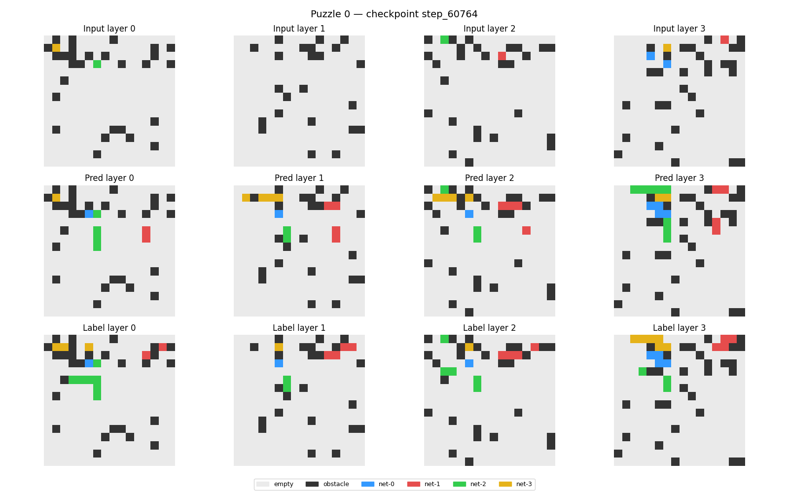
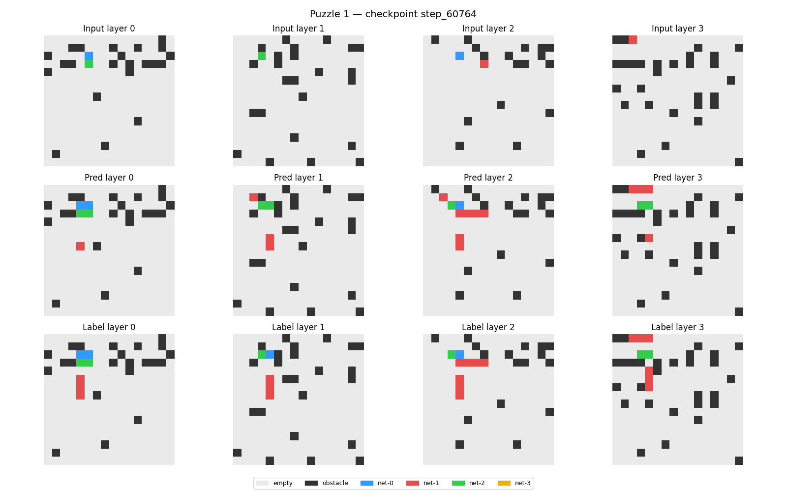

# HRM Chip Router: 7M Parameter Hierarchical Reasoning Model

[](https://opensource.org/licenses/Apache-2.0)
[](https://huggingface.co/salvadordabrown/hrm-chip-router-7m)

The Brown Forces 7M HRM Chip Router is a research release of a Hierarchical Reasoning Model (HRM) trained to solve multi-net, multi-layer 3D chip routing problems. This model routes complex 3D grids in under 2 seconds on consumer hardware, demonstrating the power of recursive reasoning in electronic design automation (EDA).

## Try it live — no Cadence license required

This is the open research release. The production-grade routing platform is launching at **[route.brownforces.io](https://route.brownforces.io)** — built on this architecture, optimized for real silicon designs (ibex, riscv32i, aes, jpeg-class and beyond). No $100k EDA license.

**[Join the waitlist at brownforces.io/chip-router](https://brownforces.io/chip-router)**

---

## Key Performance Metrics

*   **Fine-Tuned Full-Puzzle Connectivity:** **30.08%** — a **+864% explosion** over the open-source baseline (production model, actively improving)
*   **Token Accuracy:** 97.9% (3D spatial geometry fully transfers)
*   **Zero-Shot Transfer (ibex topology):** 87.6% connected, 0 obstacle violations
*   **Zero-Shot Transfer (riscv32i topology):** 65.1% connected, 0 obstacle violations
*   **Imitation Learning Baseline (this checkpoint):** 3.53% full-puzzle connectivity
*   **Connectivity Solved-Rate (Per Net):** ~25% per net (symmetrical across all 4 nets)
*   **Inference Speed:** ~2 seconds per 64-puzzle batch (RTX 5090)
*   **Model Size:** 27M physical parameters, 105 MB checkpoint (named HRM-7M following the original Samsung SAIL paper's model designation)

> **Note:** The 30.08% figure reflects the production model available at [route.brownforces.io](https://route.brownforces.io). This open-source checkpoint (step_60764) is the imitation learning baseline at 3.53%.

## Architecture

The model uses a **Hierarchical Reasoning Model (HRM)** architecture with **Adaptive Computation Time (ACT)** halting. It operates on a 16x4x16 3D grid with a vocabulary of 7 tokens.

*   **Input Grid:** 16x4x16 (Row x Layer x Column)
*   **Vocabulary:** 7 tokens (0=pad, 1=empty, 2=obstacle, 3-6=net colors 0-3)
*   **Reasoning Steps:** 16 ACT steps per inference

## Sample Visualizations

Below are sample routing results from the 7M model showing input terminals and obstacles versus the predicted routes.




## Quick Start

### Installation

```bash
git clone https://github.com/Brown-Forces-Technology-Studio-Inc/hrm-chip-router.git
cd hrm-chip-router
pip install -r requirements.txt
```

### Run Inference

Download the checkpoint from [Hugging Face](https://huggingface.co/salvadordabrown/hrm-chip-router-7m) and place it in a `checkpoints/` directory.

```python
import torch
from evaluate_checkpoints import load_model_for_checkpoint, run_inference

model, ds, meta = load_model_for_checkpoint("checkpoints/step_60764")
inputs, preds = run_inference(model, ds, meta, max_batches=1)
print(f"Routed {len(preds)} puzzles.")
```

## Citation

```bibtex
@article{trm2025,
  title={TinyRecursiveModels: Reasoning through Recursion},
  author={Samsung SAIL Montreal},
  journal={arXiv preprint arXiv:2510.04871},
  year={2025}
}

@misc{hrm_chip_router_2026,
  author = {Brown Forces Technology Studio Inc.},
  title = {HRM Chip Router: 7M Parameter Hierarchical Reasoning Model},
  year = {2026},
  publisher = {GitHub},
  howpublished = {\url{https://github.com/Brown-Forces-Technology-Studio-Inc/hrm-chip-router}}
}
```

## License

Apache License 2.0. See [LICENSE](LICENSE) for details.

---
*For more information, visit [brownforces.io](https://brownforces.io).*
